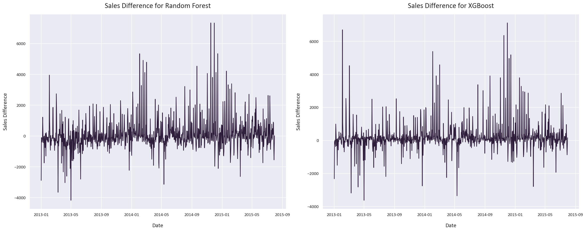

# Sales Data Analysis and Forecasting Using Ensemble Methods

Sales forecasting is a common task performed by organizations to estimate expected revenue based on historical data. This is a challenging and interesting problem because there are many factors that can influence sales. For example, the weather, the season, and the day of the week can all impact sales. In this project, we will use historical sales data from a large retailer to predict future sales using ensemble methods.

We will also perform Data Analysis and Statistical Analysis to understand the data and its features and how they can influence the sales.

The data is available on [Kaggle](https://www.kaggle.com/competitions/rossmann-store-sales/overview).

## Project Steps

1. Data Collection and Cleaning
2. Exploratory Data Analysis
3. Data Analysis and Data Visualization
4. Sales Forecasting

## Key Findings

- Storetype 1 has a higher customer count than storetype 4, but storetype 4's customers spend more on average.
- Storetype 2 has the highest customer count but the lowest sales per customer. It also has the highest average sales. However, data for storetype 2 is limited.
- Storetype 2 shows the most variability in Sales and Customers, while storetype 4 shows the least.
  These findings were inferred from these KDE and Violin plots along with statistical analysis:
  
  
  
  
  
- Assortment type 2 has the highest average and median sales and customers but the lowest sales per customer. It also shows the most variability in Sales and Customers. However, data for assortment type 2 is also limited.
- Assortment type 3 outperforms assortment type 1 in terms of average and median sales, customers, and sales per customer. Assortment type 3 appears to be the most profitable, possibly due to its wider product range.
  The assortment type findings were inferred from these:

  
  
  
  
- The Promo feature increases the sales, customers, and sales per customer for all storetypes and assortment types by a significant margin.
- The Promo2 feature has an adverse effect on the sales, customers, and sales per customer for all storetypes and assortment types.
- The sales, customers, and sales per customer are highest in December and lowest in January.
  These finding were inferred from these Catplots:

  
  
  

  The rest of the visualizations are in the images folder

## Models Used

1. **Random Forest Regressor**: This is an ensemble learning method that operates by constructing multiple decision trees during training and outputting the mean prediction of the individual trees for regression tasks. It is robust against overfitting as it averages the predictions from all the trees.

2. **XGBRegressor**: This stands for eXtreme Gradient Boosting Regressor. It is an implementation of gradient boosted decision trees designed for speed and performance. It is an iterative model that learns from its mistakes in each iteration and tries to improve its predictions in the next iteration. It is known for its effectiveness in structured or tabular datasets.
  
## Evaluation Metrics
1. **Mean Absolute Error (MAE)**: This metric calculates the average absolute difference between predicted and actual values. It gives an idea of the magnitude of the error but doesn't indicate its direction. A value of 0 indicates perfect predictions.

2. **Mean Absolute Percentage Error (MAPE)**: This metric expresses the average absolute error as a percentage of the actual values. It's calculated as `MAPE = average( abs((Actual - Predicted) / Actual) ) * 100%`. It provides a relative measure of error, which is useful when you want to understand the error proportionate to the quantities being predicted.

3. **Symmetric Mean Absolute Percentage Error (SMAPE)**: This is a variation of MAPE that treats under-forecasts and over-forecasts symmetrically. It's calculated as `SMAPE = average( 2 * abs(Actual - Predicted) / (abs(Actual) + abs(Predicted)) ) * 100%`. Unlike MAPE, SMAPE's range is bounded between 0% and 200%, making it a more balanced measure of forecast accuracy.
   
    SMAPE is often preferred over MAPE because it addresses some of the limitations of MAPE. 

    1. **Symmetry**: While MAPE can put a heavier penalty on over-forecasts compared to under-forecasts, SMAPE treats both equally. This is because SMAPE considers the absolute difference relative to the average of the actual and predicted values, rather than just the actual value.

    2. **Scale Sensitivity**: MAPE can lead to issues when the actual values are close to or equal to zero, as the error can approach infinity. SMAPE mitigates this issue by including the predicted value in the denominator.

    3. **Bound Range**: Unlike MAPE, which can theoretically range from 0% to infinity, SMAPE is bounded between 0% and 200%. This makes it easier to interpret, especially when comparing across different models or datasets.

5. **R2 Score (Coefficient of Determination)**: This metric indicates the proportion of the variance in the dependent variable that is predictable from the independent variables. It ranges from 0 to 1, with 1 indicating perfect predictions. A model that always predicts the expected value of y, disregarding the input features, would get a R^2 score of 0.0.
  
## Model Performance

Both models perform extremely well, with the XGBoost regressor performing slightly better. This is because the XGBoost regressor is an iterative model, so it can learn from its mistakes and improve its predictions. It learnt that the Promo and Promo2 features are very important, while the random forest regressor didn't learn this. 

- The MAE of the random forest regressor is 1115, with a SMAPE of 16.12% and an R2 score of 0.70.
- The MAE of the XGBoost regressor is 1031, with a SMAPE of 15.12% and an R2 score of 0.73.
  These were the feature importances for each model:
  
  
  
  These were the actual vs predicted values and sales differences for each model:
  
  

  

  Finally, these are the forecasted sales for the next 6 weeks:
  

## Usage

To run the code in this repository, you will need to have Python installed, along with the libraries listed in `requirements.txt`. You can install these with pip using the command `pip install -r requirements.txt`.

Once the dependencies are installed, you can open the notebook `sales forecasting.ipynb` in Jupyter and run the cells to execute the code.

## License

This project is licensed under the terms of the MIT license.
